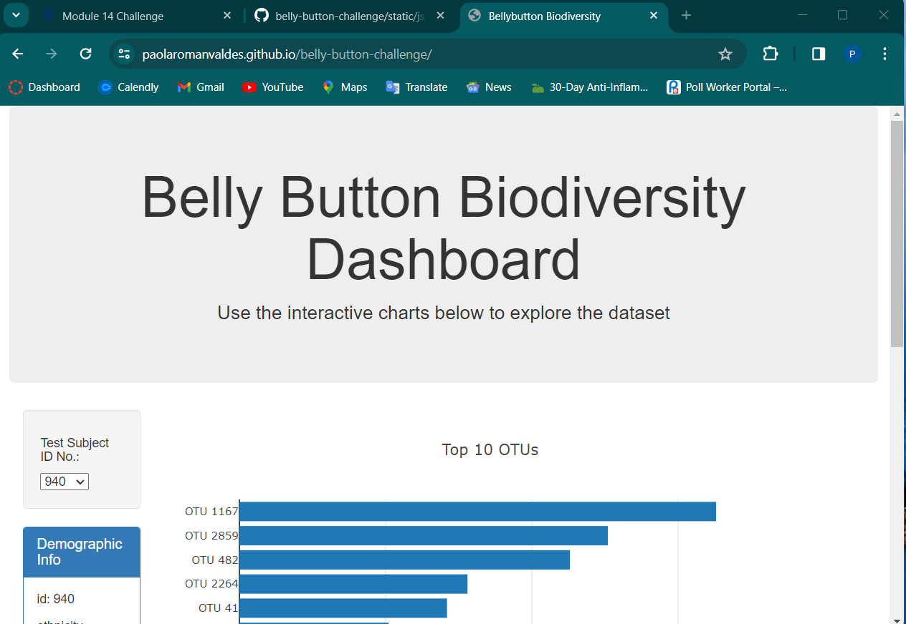
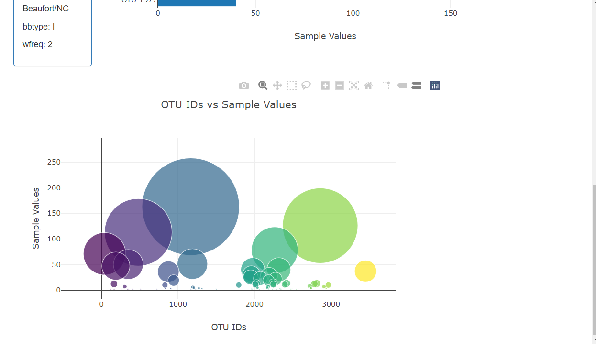

# Belly Button Challenge Visualization

This project aims to visualize data from the Belly Button Biodiversity dataset using D3.js.

## Overview

This project utilizes HTML, JavaScript, and the D3 library to create interactive visualizations of microbial data collected from belly buttons. The visualizations include a horizontal bar chart displaying the top 10 Operational Taxonomic Units (OTUs), a bubble chart showing all OTUs, and the display of sample metadata.

## Installation

To run this project locally, follow these steps:

1. Clone this repository.
2. Open the `index.html` file in a web browser.

## Usage

- Use the dropdown menu to select different samples.
- Explore the bar chart and bubble chart to visualize microbial data.
- View the sample metadata displayed on the page.

## Method

Used the D3 library to read the JSON url and set the dashboard.  Created a horizontal bar chart and a bubble graph with a dropdown menu that updates when a new sample is chosen. Displayed the metadata for the sample for every sample using key value pairs. 

## Screenshots

 

 

## Deployed App

The deployed app can be accessed [here](https://paolaromanvaldes.github.io/belly-button-challeng).

## GitHub Repository

The source code is available on GitHub [here](https://github.com/paolaromanvaldes/belly-button-challenge).

## Credits

This project is based on the Module 14 Challenge from a Data Visualization course.
